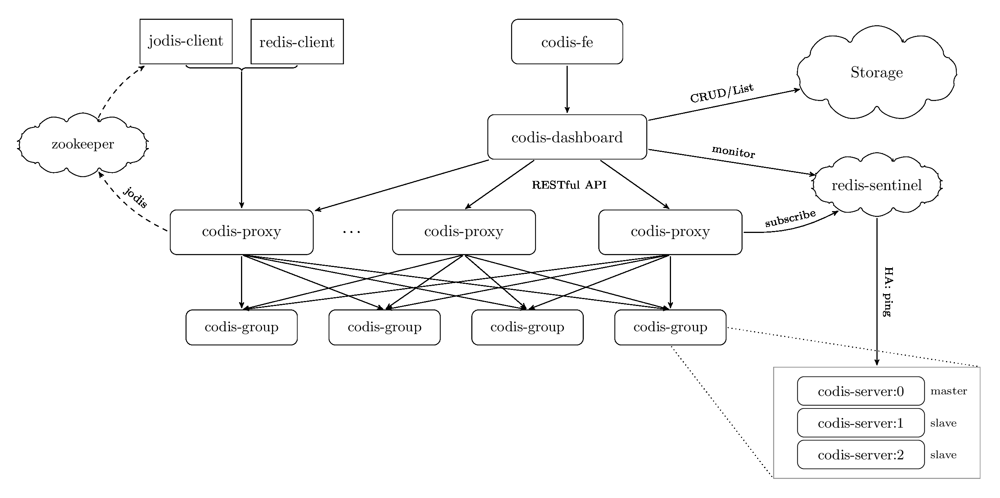

#Codis - yet another safe & fast distributed solution for Redis

Codis is a proxy based high performance Redis cluster solution written in Go/C, an alternative to Twemproxy.

Codis supports multiple stateless proxy with multiple redis instances.

Codis is engineered to elastically scale, Easily add or remove redis or proxy instances on-demand/dynamicly.

Codis is production-ready and is widely used by Wandoujia.com.

##Features

* Extremely simple to use 
* Supports most of Redis commands, Fully compatible with twemproxy(https://github.com/twitter/twemproxy)
* Native Redis clients are supported
* Safe and transparent data migration, Easily add or remove nodes on-demand.
* Auto rebalance
* GUI dashboard & admin tools 
* Command-line interface is also provided
* RESTful APIs

## Build and Install

* Install go
* go get github.com/wandoulabs/codis
* cd codis
* ./bootstrap.sh
* make gotest
* cd sample
* follow instructions in usage.md

## Tutorial

[中文教程](https://github.com/wandoulabs/codis/blob/master/doc/tutorial_zh.md)

[English (WIP) ](https://github.com/wandoulabs/codis/blob/master/doc/tutorial_en.md)

## FAQ

[中文](https://github.com/wandoulabs/codis/blob/master/doc/FAQ_zh.md)

English (WIP)

## Performance

TBD

## Architecture

## Snapshots

## Authors

* @goroutine
* @c4pt0r
* @spinlock9

Thanks:

* wangyezhao

## License

Codis is licensed under MIT
