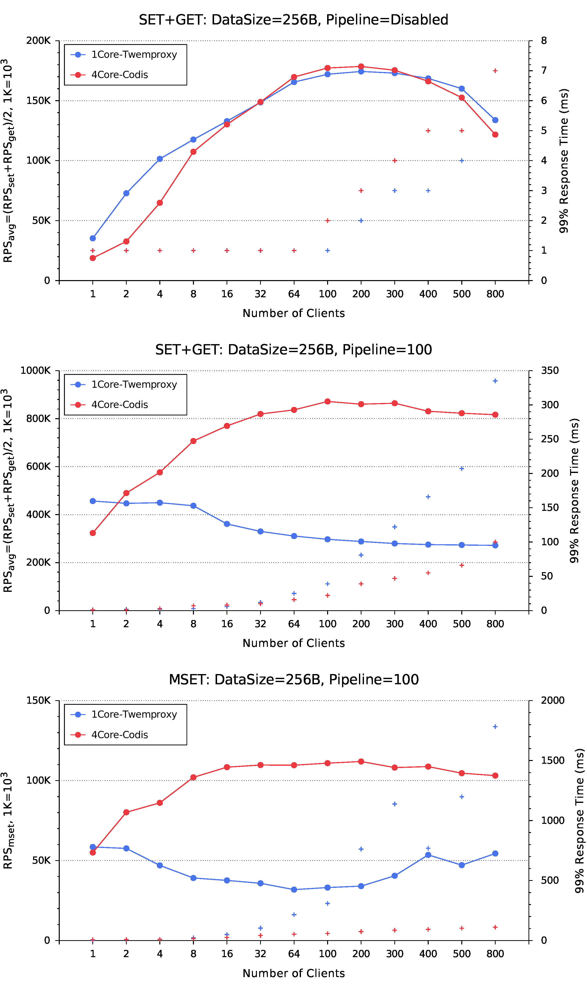
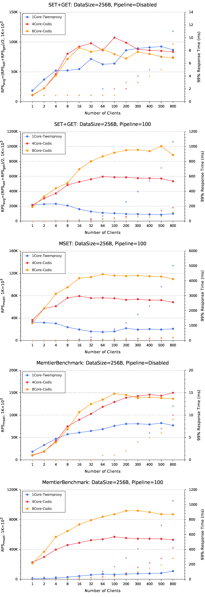

## Performance (Benchmark)
#### Intel(R) Core(TM) i7-4770 CPU @ 3.40GHz x 1 + 16G RAM
+ Archlinux: 4.0.5-1-ARCH #1 SMP PREEMPT Sat Jun 6 18:37:49 CEST 2015 x86\_64 GNU/Linux

+ Go: go version go1.4.2 linux/amd64

+ Redis x 4:

```bash
  for i in {6380..6383}; do
    nohup codis-server ${i}.conf &
  done
```

+ Twemproxy - 1CPU:
  - nutcracker -c nutcracker.yml

```yml
alpha:
  listen: 127.0.0.1:22120
  hash: crc32a
  hash_tag: "{}"
  distribution: ketama
  auto_eject_hosts: false
  timeout: 400
  redis: true
  servers:
   - 127.0.0.1:6380:1
   - 127.0.0.1:6381:1
   - 127.0.0.1:6382:1
   - 127.0.0.1:6383:1
```

+ Codis - 4CPU:

```bash
codis-proxy --ncpu=4 -c config.toml -L proxy.log \
  --host-proxy=0.0.0.0:19000 --host-admin=0.0.0.0:10000 &
```

+ RedisBenchmark - 1CPU:

```bash
for clients in {1,2,4,8,16,32,64,100,200,300,500,800}; do
  redis-benchmark -p $target -c $clients -n 5000000 -P 100 \
    -r 1048576 -d 256 -t get,set,mset
done
```

+ Benchmark Results:



#### Intel(R) Xeon(R) CPU E5-2620 v2 @ 2.10GHz x 2 + 64G RAM
+ CentOS: 2.6.32-279.el6.x86\_64 #1 SMP Fri Jun 22 12:19:21 UTC 2012 x86\_64 x86\_64 x86\_64 GNU/Linux

+ Go: go version go1.3.3 linux/amd64

+ Redis x 8:

```bash
  for i in {6380..6387}; do
    nohup codis-server ${i}.conf &
  done
```

+ Twemproxy - 1CPU:
  - nutcracker -c nutcracker.yml

```yml
alpha:
  listen: 127.0.0.1:22120
  hash: crc32a
  hash_tag: "{}"
  distribution: ketama
  auto_eject_hosts: false
  timeout: 400
  redis: true
  servers:
   - 127.0.0.1:6380:1
   - 127.0.0.1:6381:1
   - 127.0.0.1:6382:1
   - 127.0.0.1:6383:1
   - 127.0.0.1:6384:1
   - 127.0.0.1:6385:1
   - 127.0.0.1:6386:1
   - 127.0.0.1:6387:1
```

+ Codis - 4CPU or 8CPU:

```bash
codis-proxy --ncpu=4 -c config.toml -L proxy.log \
  --host-proxy=0.0.0.0:19000 --host-admin=0.0.0.0:10000 &
```

```bash
codis-proxy --ncpu=8 -c config.toml -L proxy.log \
  --host-proxy=0.0.0.0:19000 --host-admin=0.0.0.0:10000 &
```

+ RedisBenchmark - 1CPU:

```bash
for clients in {1,2,4,8,16,32,64,100,200,300,500,800}; do
  redis-benchmark -p $target -c $clients -n 5000000 -P 100 \
    -r 1048576 -d 256 -t get,set,mset
done
```

+ MemtierBenchmark - 4CPU:

```bash
for i in {1,2,4,8,16,32,64,100,200,300,500,800}; do
  nthread=4
  if [ $i -lt 4 ]; then
    nthread=1
  fi
  let nclient="$i/$nthread"
  memtier_benchmark -p $target -t $nthread -c $nclient \
    --ratio=1:1 --test-time 30 -d 256 --key-pattern=S:S --pipeline=100
done
```

+ Benchmark Results:


