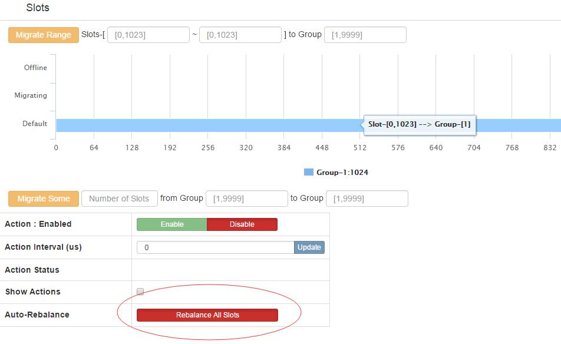

# Codis Tutorial

Codis is a distributed Redis solution, there is no obvious difference between connecting to a Codis proxy and an original Redis server, top layer application can connect to Codis as normal standalone Redis, Codis will forward low layer requests. Hot data migration and all things in the shadow are transparent to client. Simply treat Coids as a Redis service with unlimited RAM. 


Codis 3.x consists of the following components:

* **Codis Server**: based on redis-3.2.8 branch development. Added additional data structures to support slot-related operations and data migration instructions. Specific changes can refer to the document [redis changes] (redis_change_zh.md).

* **Codis Proxy**: is the proxy service of client connections. Codis Proxy Implements Redis Protocol. In addition to some commands do not support ([unsupported command list] (unsupported_cmds.md)).

    + For the same product cluster, you can deploy multiple codis-proxy instances at the same time;
    + Different codis-proxy by codis-dashboard to ensure state synchronization.

* **Codis Dashboard**: cluster management tools, support codis-proxy, codis-server add, delete, slot migrate(sync/async), and other operations. When a cluster state changes, the codis-dashboard maintains the consistency of all codis-proxy states under the cluster.

    + For the same product cluster, the same time codis-dashboard can only have 0 or 1;
    + All changes to the cluster must be done via codis-dashboard.

* **Codis Admin**: Command-line tool for cluster management.

    + Can be used to control the codis-proxy, codis-dashboard status, and access external storage.

* **Codis FE**: cluster management Web Interface.

    + Multiple cluster instances can share the same front-end display page;
    + FE reads all cluster instances name from external storage.

* **Storage**: Provides external storage for cluster status, and saves cluster metadata.

    + Provide the concept of Namespace, different clusters will be organized according to different product name;
    + Currently only provides Zookeeper, Etcd, Fs three implementations, but provides an abstract interface can be self-expansion.


##  Getting Codis

### Download Pre-built Release Binaries

The easiest way to get codis is to use one of the pre-built release binaries which are available for OSX, Linux. Instructions for using these binaries are on the [GitHub releases page][github-release].

### Compile Source Code

For those wanting to try the very latest version, build the latest version of codis from the `master` branch. This first needs [*Go*](https://golang.org/) installed (version 1.7+ is required). All development occurs on `master`, including new features and bug fixes. Bug fixes are first targeted at `master` and subsequently ported to release branches.


#### 1. Install Go Environment [reference](https://golang.org/doc/install)

After the installation is complete, you can run the following command to detect：

```bash
$ go version
go version go1.7.3 linux/amd64
```

#### 2. Set the compilation environment

Add `$GOPATH/bin` To `$PATH`，For Example：`PATH=$PATH:$GOPATH/bin`。

```bash
$ go env GOPATH
/home/codis/gopath
```

#### 3. Download Codis Source Code

The Codis source code needs to be downloaded to `$GOPATH/src/github.com/CodisLabs/codis`：

```bash
$ mkdir -p $GOPATH/src/github.com/CodisLabs
$ cd $_ && git clone https://github.com/CodisLabs/codis.git -b release3.2
```

#### 4. Compile Codis Source Code

* use make tool to compile：

```bash
$ cd $GOPATH/src/github.com/CodisLabs/codis
$ make
make -j -C extern/redis-3.2.8/
... ...
go build -i -o bin/codis-dashboard ./cmd/dashboard
go build -i -o bin/codis-proxy ./cmd/proxy
go build -i -o bin/codis-admin ./cmd/admin
go build -i -o bin/codis-fe ./cmd/fe

$ ls bin/
total 69124
drwxr-xr-x 4 codis codis     4096 Jan  4 14:55 assets
-rwxr-xr-x 1 codis codis 17600752 Jan  4 14:55 codis-admin
-rwxr-xr-x 1 codis codis 18416320 Jan  4 14:55 codis-dashboard
-rwxr-xr-x 1 codis codis  9498040 Jan  4 14:55 codis-fe
-rwxr-xr-x 1 codis codis 11057280 Jan  4 14:55 codis-proxy
-rwxr-xr-x 1 codis codis  4234432 Jan  4 14:55 codis-server
-rw-r--r-- 1 codis codis      148 Jan  4 14:55 version
... ...

$ cat bin/version
version = 2016-01-03 14:53:22 +0800 @51f06ae3b58a256a58f857f590430977638846a3
compile = 2016-01-04 15:00:17 +0800 by go version go1.5.2 linux/amd64
```

## Running Codis Cluster

Build a standalone codis cluster in 2 minutes,without any external component dependencies.
The admin folder in the source code provides a series of scripts to quickly start, stop the codis components, improve the efficiency of operation and maintenance.


### Start codis-dashboard
Use codis-dashboard-admin.sh script to start dashboard and check the dashboard log to confirm whether there is an exception.
```
./admin/codis-dashboard-admin.sh start
 tail -100 ./log/codis-dashboard.log.2017-04-08
```
```
2017/04/08 15:16:57 fsclient.go:197: [INFO] fsclient - create /codis3/codis-demo/topom OK
2017/04/08 15:16:57 main.go:140: [WARN] [0xc42025f7a0] dashboard is working ...
2017/04/08 15:16:57 topom.go:424: [WARN] admin start service on [::]:18080

```

The default external storage Uses filesystem, the default data path is saved in /tmp/codis. If the startup fails, please check whether the current user has read/write access to the path.


### Start codis-proxy
Use codis-proxy-admin.sh script to start codis-proxy and check the proxy log to confirm whether there is an exception.
```
./admin/codis-proxy-admin.sh start
tail -100 ./log/codis-proxy.log.2017-04-08
```

```
2017/04/08 15:39:37 proxy.go:293: [WARN] [0xc4200df760] set sentinels = []
2017/04/08 15:39:37 main.go:320: [WARN] rpc online proxy seems OK
2017/04/08 15:39:38 main.go:210: [WARN] [0xc4200df760] proxy is working ...
```

### Start codis-server
Use codis-server-admin.sh script to start codis-server and check the redis log to confirm whether there is an exception.
```
./admin/codis-server-admin.sh start
tail -100 /tmp/redis_6379.log 
```

```
5706:M 08 Apr 16:04:11.748 * DB loaded from disk: 0.000 seconds
5706:M 08 Apr 16:04:11.748 * The server is now ready to accept connections on port 6379
```
redis.conf pidfile,logfile default saves in the /tmp directory. If the startup fails, please check whether the current user has read/write access to the path.

### Start codis-fe
Use codis-fe-admin.sh script to start codis-fe and check the redis log to confirm whether there is an exception.
```
./admin/codis-fe-admin.sh start
tail -100 ./log/codis-fe.log.2017-04-08
```
```
2017/04/08 16:12:13 main.go:100: [WARN] set ncpu = 1
2017/04/08 16:12:13 main.go:103: [WARN] set listen = 0.0.0.0:9090
2017/04/08 16:12:13 main.go:115: [WARN] set assets = /home/codis/go/src/github.com/CodisLabs/codis/admin/../bin/assets
2017/04/08 16:12:13 main.go:153: [WARN] set --filesystem = /tmp/codis
```

### Add group by fe

Please visit the cluster management web page(fe url:127.0.0.1:9090)
Select the cluster(codis-demo) we have just built, in the Proxy column we can see that we have activated the Proxy,
But the Group column is empty, because codis-server is not joined the cluster.

Add NEW GROUP
In the `NEW GROUP` row, please input a number such as 1, and click NEWGROUP

Add Codis Server

In the `Add Server` row, please input the codis-server address we just started, add it to GROUP, and then click the Add Server button, as shown below


### Initialize slot by fe

The new cluster slot status is offline, so we need to initialize it (allocate 1024 slots to each group), and the fastest way to initialize a cluster is to click the `rebalance all slots` button provided by fe, as shown in the following figure.




## Quickly deploy the cluster by ansible

Use ansible to quickly deploy multiple clusters in standalone and multi-machine environment.
The ansible folder contains the playbook for deploying the codis cluster, modifying the parameters in the groups_var / all file according to your own deployment environment, and modifying the hosts file to add the deployed environment IP.

Ansible installation is simple.Once Ansible is installed, there will be no daemons to start or keep running. You only need to install it on one machine and it can manage an entire fleet of remote machines from that central point. 
Ansible by default manages machines over the SSH protocol.

```
git clone https://github.com/ansible/ansible.git -b stable-2.3
cd ./ansible
source ./hacking/env-setup
cd $codis_dir/ansible
ansible-playbook -i hosts site.yml
```


## Codis HA

Codis's proxy is stateless so you can run more than one proxies to get high availability and horizontal scalability.

For Java users, you can use a modified Jedis, [Jodis](https://github.com/CodisLabs/jodis). It will watch the ZooKeeper to get the real-time available proxies, then query via them using a round robin policy to balance load and detect proxy online and offline automatically.
If asynchronous request is required, you can use [Nedis](https://github.com/CodisLabs/nedis) which is implemented based on Netty.

Codis-server is stateful.Redis Sentinel provides high availability for Codis-Server.Codis uses it to check master and slave instances are working as expected and start a failover process where a slave is promoted to master, the other additional slaves are reconfigured to use the new master.

