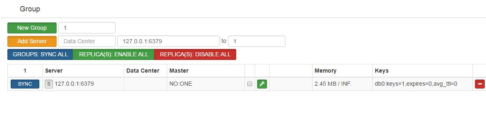

# Codis 使用文档

Codis 是一个分布式 Redis 解决方案, 对于上层的应用来说, 连接到 Codis Proxy 和连接原生的 Redis Server 没有显著区别 ([不支持的命令列表](unsupported_cmds.md)), 上层应用可以像使用单机的 Redis 一样使用, Codis 底层会处理请求的转发, 不停机的数据迁移等工作, 所有后边的一切事情, 对于前面的客户端来说是透明的, 可以简单的认为后边连接的是一个内存无限大的 Redis 服务。

## codis版本简介
codis目前主要release版本如下:
### codis 1.9
> * codis-server 基于 redis-2.8.13
> * codis-proxy 对 pipeline 支持不友好
> * codis-proxy 对 zk 强依赖
> * 同步迁移性能差，不支持大 key 迁移
### codis 2.0
> * codis-server 基于 redis-2.8.21
> * 重构了codis-proxy，性能大幅提升，对 pipeline 支持比较好
> * codis-proxy 对 zk 强依赖
> * 同步迁移性能差，不支持大key迁移
### codis 3.x
> * 最新 release 版本为 codis-3.2，codis-server 基于 redis-3.2.8
> * 支持 slot 同步迁移、异步迁移和并发迁移，对 key 大小无任何限制，迁移性能大幅度提升
> * 相比 2.0：重构了整个集群组件通信方式，codis-proxy 与 zookeeper 实现了解耦，废弃了codis-config 等
> * 元数据存储支持 etcd/zookeeper/filesystem 等，可自行扩展支持新的存储，集群正常运行期间，即便元存储故障也不再影响 codis 集群，大大提升 codis-proxy 稳定性
> * 对 codis-proxy 进行了大量性能优化,通过控制GC频率、减少对象创建、内存预分配、引入 `cgo`、`jemalloc` 等，使其吞吐还是延迟，都已达到 codis 项目中最佳
> * proxy 实现 select 命令，支持多 DB
> * proxy 支持读写分离、优先读同 IP/同 DC 下副本功能
> * 基于 redis-sentinel 实现主备自动切换
> * 实现动态 pipeline 缓存区（减少内存分配以及所引起的 GC 问题）
> * proxy 支持通过 HTTP 请求实时获取 runtime metrics，便于监控、运维
> * 支持通过 influxdb 和 statsd 采集 proxy metrics
> * slot auto rebalance 算法从 2.0 的基于 max memory policy 变更成基于 group 下 slot 数量
> * 提供了更加友好的 dashboard 和 fe 界面，新增了很多按钮、跳转链接、错误状态等，有利于快速发现、处理集群故障
> * 新增 `SLOTSSCAN` 指令，便于获取集群各个 slot 下的所有 key
> * codis-proxy 与 codis-dashbaord 支持 docker 部署

Codis 3.x 由以下组件组成：

* **Codis Server**：基于 redis-3.2.8 分支开发。增加了额外的数据结构，以支持 slot 有关的操作以及数据迁移指令。具体的修改可以参考文档 [redis 的修改](redis_change_zh.md)。

* **Codis Proxy**：客户端连接的 Redis 代理服务, 实现了 Redis 协议。 除部分命令不支持以外([不支持的命令列表](unsupported_cmds.md))，表现的和原生的 Redis 没有区别（就像 Twemproxy）。

    + 对于同一个业务集群而言，可以同时部署多个 codis-proxy 实例；
    + 不同 codis-proxy 之间由 codis-dashboard 保证状态同步。

* **Codis Dashboard**：集群管理工具，支持 codis-proxy、codis-server 的添加、删除，以及据迁移等操作。在集群状态发生改变时，codis-dashboard 维护集群下所有 codis-proxy 的状态的一致性。

    + 对于同一个业务集群而言，同一个时刻 codis-dashboard 只能有 0个或者1个；
    + 所有对集群的修改都必须通过 codis-dashboard 完成。

* **Codis Admin**：集群管理的命令行工具。

    + 可用于控制 codis-proxy、codis-dashboard 状态以及访问外部存储。

* **Codis FE**：集群管理界面。

    + 多个集群实例共享可以共享同一个前端展示页面；
    + 通过配置文件管理后端 codis-dashboard 列表，配置文件可自动更新。

* **Storage**：为集群状态提供外部存储。

    + 提供 Namespace 概念，不同集群的会按照不同 product name 进行组织；
    + 目前仅提供了 Zookeeper、Etcd、Fs 三种实现，但是提供了抽象的 interface 可自行扩展。

## 0. 下载与编译

### 下载[release binary](https://github.com/CodisLabs/codis/releases)文件安装
如果是重要的生产环境使用，尽量不要选择alpha、rc版本。
根据自己的部署平台，选择相应的文件下载即可。

### 编译源码安装

#### 1. 安装 Go 运行环境 [参考这里](https://golang.org/doc/install)

安装完成后可以运行下列命令进行检测：

```bash
$ go version
go version go1.7.3 linux/amd64
```

#### 2. 设置编译环境

**注意 `$GOPATH` 是本机所有第三方库 go 项目所在目录，Codis 仅是其中之一。**

添加 `$GOPATH/bin` 到 `$PATH`，例如：`PATH=$PATH:$GOPATH/bin`。

```bash
$ go env GOPATH
/home/codis/gopath
```

#### 3. 下载 Codis 源代码

Codis 源代码需要下载到 `$GOPATH/src/github.com/CodisLabs/codis`：

```bash
$ mkdir -p $GOPATH/src/github.com/CodisLabs
$ cd $_ && git clone https://github.com/CodisLabs/codis.git -b release3.2
```

#### 4. 编译 Codis 源代码

* 直接通过 make 进行编译，会看到如下输出：

```bash
$ cd $GOPATH/src/github.com/CodisLabs/codis
$ make
make -j -C extern/redis-3.2.8/
... ...
go build -i -o bin/codis-dashboard ./cmd/dashboard
go build -i -o bin/codis-proxy ./cmd/proxy
go build -i -o bin/codis-admin ./cmd/admin
go build -i -o bin/codis-fe ./cmd/fe

$ ls bin/
total 69124
drwxr-xr-x 4 codis codis     4096 Jan  4 14:55 assets
-rwxr-xr-x 1 codis codis 17600752 Jan  4 14:55 codis-admin
-rwxr-xr-x 1 codis codis 18416320 Jan  4 14:55 codis-dashboard
-rwxr-xr-x 1 codis codis  9498040 Jan  4 14:55 codis-fe
-rwxr-xr-x 1 codis codis 11057280 Jan  4 14:55 codis-proxy
-rwxr-xr-x 1 codis codis  4234432 Jan  4 14:55 codis-server
-rw-r--r-- 1 codis codis      148 Jan  4 14:55 version
... ...

$ cat bin/version
version = 2016-01-03 14:53:22 +0800 @51f06ae3b58a256a58f857f590430977638846a3
compile = 2016-01-04 15:00:17 +0800 by go version go1.5.2 linux/amd64
```

## 1. 快速启动
2分钟快速构建一个单机版测试 codis 集群，无任何外部组件依赖.

源码中 admin 文件夹提供了一系列脚本以便快速启动、停止各个组件，提高运维效率。

### 启动codis-dashboard
使用 `codis-dashboard-admin.sh` 脚本启动 dashboard，并查看 dashboard 日志确认启动是否有异常。

```
./admin/codis-dashboard-admin.sh start
 tail -100 ./log/codis-dashboard.log.2017-04-08
```
```
2017/04/08 15:16:57 fsclient.go:197: [INFO] fsclient - create /codis3/codis-demo/topom OK
2017/04/08 15:16:57 main.go:140: [WARN] [0xc42025f7a0] dashboard is working ...
2017/04/08 15:16:57 topom.go:424: [WARN] admin start service on [::]:18080
```

快速启动集群元数据存储使用 `filesystem`，默认数据路径保存在 `/tmp/codis`，若启动失败，请检查当前用户是否对该路径拥有读写权限。

### 启动codis-proxy
使用 `codis-proxy-admin.sh` 脚本启动 codis-proxy，并查看 proxy 日志确认启动是否有异常。

```
./admin/codis-proxy-admin.sh start
tail -100 ./log/codis-proxy.log.2017-04-08
```
```
2017/04/08 15:39:37 proxy.go:293: [WARN] [0xc4200df760] set sentinels = []
2017/04/08 15:39:37 main.go:320: [WARN] rpc online proxy seems OK
2017/04/08 15:39:38 main.go:210: [WARN] [0xc4200df760] proxy is working ...
```

### 启动codis-server
使用 `codis-server-admin.sh` 脚本启动 codis-server，并查看 redis 日志确认启动是否有异常。

```
./admin/codis-server-admin.sh start
tail -100 /tmp/redis_6379.log 
```
```
5706:M 08 Apr 16:04:11.748 * DB loaded from disk: 0.000 seconds
5706:M 08 Apr 16:04:11.748 * The server is now ready to accept connections on port 6379
```
redis.conf 配置中 pidfile、logfile 默认保存在 `/tmp` 目录，若启动失败，请检查当前用户是否有该目录的读写权限。

### 启动codis-fe
使用 `codis-fe-admin.sh` 脚本启动 codis-fe，并查看 fe 日志确认启动是否有异常。

```
./admin/codis-fe-admin.sh start
tail -100 ./log/codis-fe.log.2017-04-08
```
```
2017/04/08 16:12:13 main.go:100: [WARN] set ncpu = 1
2017/04/08 16:12:13 main.go:103: [WARN] set listen = 0.0.0.0:9090
2017/04/08 16:12:13 main.go:115: [WARN] set assets = /home/codis/go/src/github.com/CodisLabs/codis/admin/../bin/assets
2017/04/08 16:12:13 main.go:153: [WARN] set --filesystem = /tmp/codis
```

### 通过fe添加group
通过web浏览器访问集群管理页面(fe地址:127.0.0.1:9090)
选择我们刚搭建的集群 codis-demo，在 Proxy 栏可看到我们已经启动的 Proxy，
但是 Group 栏为空，因为我们启动的 codis-server 并未加入到集群
添加 `NEW GROUP`，`NEW GROUP` 行输入 1，再点击 `NEW GROUP` 即可
添加 Codis Server，`Add Server` 行输入我们刚刚启动的 codis-server 地址，添加到我们刚新建的 Group，然后再点击 `Add Server` 按钮即可，如下图所示



### 通过fe初始化slot
新增的集群 slot 状态是 offline，因此我们需要对它进行初始化（将 1024 个 slot 分配到各个 group），而初始化最快的方法可通过 fe 提供的 `rebalance all slots` 按钮来做，如下图所示，点击此按钮，我们即快速完成了一个集群的搭建。


## 通过 ansible 快速部署集群

使用 ansible 可快速在单机、多机部署多套 codis 集群。
ansible 文件夹包含了部署 codis 集群的 playbook，根据自己部署环境修改 `groups_var/all` 文件里参数，修改 hosts 文件添加部署的环境 IP 即可。
ansible 安装也及其简单，各部署机器无需安装任何额外的 agent，彼此之间通过 ssh 通信。

```
git clone https://github.com/ansible/ansible.git -b stable-2.3
cd ./ansible
source ./hacking/env-setup
cd $codis_dir/ansible
ansible-playbook -i hosts site.yml
```


## 2. 启动及参数

**注意：请按照顺序逐步完成操作。生产环境建议修改dashboard coordinator_name配置，使用 `zookeeper` 或`etctd`作为外部存储。**

**注意：Codis 3.x 支持 AUTH，但是要求所有组件使用的 AUTH 必须完全相同。**

#### 2.1 Codis Dashboard

##### 2.1.1 启动命令：

```bash
$ nohup ./bin/codis-dashboard --ncpu=4 --config=dashboard.toml \
    --log=dashboard.log --log-level=WARN &
```

默认配置文件 `dashboard.toml` 可由 codis-dashboard 生成。

##### 2.1.2 详细说明：

+ 启动参数说明：

```bash
$ ./bin/codis-dashboard -h
Usage:
    codis-dashboard [--ncpu=N] [--config=CONF] [--log=FILE] [--log-level=LEVEL] [--host-admin=ADDR]
    codis-dashboard  --default-config
    codis-dashboard  --version

Options:
    --ncpu=N                    最大使用 CPU 个数
    -c CONF, --config=CONF      指定启动配置文件
    -l FILE, --log=FILE         设置 log 输出文件
    --log-level=LEVEL           设置 log 输出等级：INFO,WARN,DEBUG,ERROR；默认INFO，推荐WARN
```

参数 `--host-admin` 请参见与 Docker 有关章节。

+ 默认配置文件：

```bash
$ ./bin/codis-dashboard --default-config | tee dashboard.toml
##################################################
#                                                #
#                  Codis-Dashboard               #
#                                                #
##################################################

# Set Coordinator, only accept "zookeeper" & "etcd"
coordinator_name = "zookeeper"
coordinator_addr = "127.0.0.1:2181"

# Set Codis Product {Name/Auth}.
product_name = "codis-demo"
product_auth = ""

# Set bind address for admin(rpc), tcp only.
admin_addr = "0.0.0.0:18080"
```

| 参数              | 说明                               |
|:----------------- |:---------------------------------- |
| coordinator\_name | 外部存储类型，接受 zookeeper/etcd  |
| coordinator\_addr | 外部存储地址                       |
| product\_name     | 集群名称，满足正则 `\w[\w\.\-]*`   |
| product\_auth     | 集群密码，默认为空                 |
| admin\_addr       | RESTful API 端口                   |

#### 2.2 Codis Proxy

##### 2.2.1 启动命令：

```bash
$ nohup ./bin/codis-proxy --ncpu=4 --config=proxy.toml \
    --log=proxy.log --log-level=WARN &
```

默认配置文件 `proxy.toml` 可由 codis-proxy 生成。

codis-proxy 启动后，处于 `waiting` 状态，监听 `proxy_addr` 地址，但是不会 `accept` 连接，添加到集群并完成集群状态的同步，才能改变状态为 `online`。添加的方法有以下两种：

+ 通过 codis-fe 添加：通过 `Add Proxy` 按钮，将 `admin_addr` 加入到集群中；
+ 通过 codis-admin 命令行工具添加，方法如下：

```bash
$ ./bin/codis-admin --dashboard=127.0.0.1:18080 --create-proxy -x 127.0.0.1:11080
```

其中 `127.0.0.1:18080` 以及 `127.0.0.1:11080` 分别为 dashboard 和 proxy 的 `admin_addr` 地址；

添加过程中，dashboard 会完成如下一系列动作：

+ 获取 proxy 信息，对集群 name 以及 auth 进行验证，并将其信息写入到外部存储中；
+ 同步 slots 状态；
+ 标记 proxy 状态为 `online`，此后 proxy 开始 `accept` 连接并开始提供服务；

##### 2.2.2 详细说明：

+ 启动参数说明：

```bash
$ ./bin/codis-proxy -h
Usage:
	codis-proxy [--ncpu=N] [--config=CONF] [--log=FILE] [--log-level=LEVEL] [--host-admin=ADDR] [--host-proxy=ADDR] [--ulimit=NLIMIT]
	codis-proxy  --default-config
	codis-proxy  --version

Options:
	--ncpu=N                    最大使用 CPU 个数
	-c CONF, --config=CONF      指定启动配置文件
	-l FILE, --log=FILE         设置 log 输出文件
	--log-level=LEVEL           设置 log 输出等级：INFO,WARN,DEBUG,ERROR；默认INFO，推荐WARN
	--ulimit=NLIMIT             检查 ulimit -n 的结果，确保运行时最大文件描述不少于 NLIMIT
```

参数 `--host-proxy` 以及 `--host-admin` 请参见与 Docker 有关章节。

+ 默认配置文件：

```bash
$ ./bin/codis-proxy --default-config | tee proxy.toml
##################################################
#                                                #
#                  Codis-Proxy                   #
#                                                #
##################################################

# Set Codis Product {Name/Auth}.
product_name = "codis-demo"
product_auth = ""

# Set bind address for admin(rpc), tcp only.
admin_addr = "0.0.0.0:11080"

# Set bind address for proxy, proto_type can be "tcp", "tcp4", "tcp6", "unix" or "unixpacket".
proto_type = "tcp4"
proxy_addr = "0.0.0.0:19000"

# Set jodis address & session timeout.
jodis_addr = ""
jodis_timeout = 10
jodis_compatible = false

# Proxy will ping-pong backend redis periodly to keep-alive
backend_ping_period = 5

# If there is no request from client for a long time, the connection will be droped. Set 0 to disable.
session_max_timeout = 1800

# Buffer size for each client connection.
session_max_bufsize = 131072

# Number of buffered requests for each client connection.
# Make sure this is higher than the max number of requests for each pipeline request, or your client may be blocked.
session_max_pipeline = 1024

# Set period between keep alives. Set 0 to disable.
session_keepalive_period = 60
```

| 参数                        | 说明                                                     |
|:--------------------------- |:-------------------------------------------------------- |
| product\_name               | 集群名称，参考 dashboard 参数说明                        |
| product\_auth               | 集群密码，默认为空                                       |
| admin\_addr                 | RESTful API 端口                                         |
| proto\_type                 | Redis 端口类型，接受 tcp/tcp4/tcp6/unix/unixpacket       |
| proxy\_addr                 | Redis 端口地址或者路径                                   |
| jodis\_addr                 | Jodis 注册 zookeeper 地址                                |
| jodis\_timeout              | Jodis 注册 session timeout 时间，单位 second             |
| jodis\_compatible           | **Jodis 注册 zookeeper 的路径**                          |
| backend\_ping\_period       | 与 codis-server 探活周期，单位 second，0 表示禁止        |
| session\_max\_timeout       | 与 client 连接最大读超时，单位 second，0 表示禁止        |
| session\_max\_bufsize       | 与 client 连接读写缓冲区大小，单位 byte                  |
| session\_max\_pipeline      | 与 client 连接最大的 pipeline 大小                       |
| session\_keepalive\_period  | 与 client 的 tcp keepalive 周期，仅 tcp 有效，0 表示禁止 |

**注：Codis3 会将 jodis 节点注册在 `/jodis/{PRODUCT_NAME}` 下，这点与 Codis2 不太兼容，所以为了兼容性，可以考虑将 `jodis_compatible` 设置成 `true`。**

#### 2.3 Codis Server

+ 启动 ./bin/codis-server，与启动普通 redis 的方法一致。

+ 启动完成后，可以通过 codis-fe 提供的界面或者 codis-admin 命令行工具添加到集群中。

#### 2.4 Codis FE（可选组件）

##### 2.4.1 启动命令：

```bash
$ nohup ./bin/codis-fe --ncpu=4 --log=fe.log --log-level=WARN \
    --zookeeper=127.0.0.1:2181 --listen=127.0.0.1:8080 &
```

##### 2.4.2 详细说明：

+ 启动参数说明：

```bash
$ ./bin/codis-fe -h
Usage:
	codis-fe [--ncpu=N] [--log=FILE] [--log-level=LEVEL] [--assets-dir=PATH] (--dashboard-list=FILE|--zookeeper=ADDR|--etcd=ADDR|--filesystem=ROOT) --listen=ADDR
	codis-fe  --version

Options:
	--ncpu=N                        最大使用 CPU 个数
	-d LIST, --dashboard-list=LIST  配置文件，能够自动刷新
	-l FILE, --log=FILE             设置 log 输出文件
	--log-level=LEVEL               设置 log 输出等级：INFO,WARN,DEBUG,ERROR；默认INFO，推荐WARN
	--listen=ADDR                   HTTP 服务端口
```

配置文件 codis.json 可以手动编辑，也可以通过 codis-admin 从外部存储中拉取，例如：

```bash
$ ./bin/codis-admin --dashboard-list --zookeeper=127.0.0.1:2181 | tee codis.json
[
    {
        "name": "codis-demo",
        "dashboard": "127.0.0.1:18080"
    },
    {
        "name": "codis-demo2",
        "dashboard": "127.0.0.1:28080"
    }
]
```

#### 2.5 Codis Admin（命令行工具）

**注意：使用 codis-admin 是十分危险的。**

##### 2.5.1 codis-dashboard 异常退出的修复

当 codis-dashboard 启动时，会在外部存储上存放一条数据，用于存储 dashboard 信息，同时作为 LOCK 存在。当 codis-dashboard 安全退出时，会主动删除该数据。当 codis-dashboard 异常退出时，由于之前 LOCK 未安全删除，重启往往会失败。因此 codis-admin 提供了强制删除工具：

1. 确认 codis-dashboard 进程已经退出（**很重要**）；
2. 运行 codis-admin 删除 LOCK：

```bash
$ ./bin/codis-admin --remove-lock --product=codis-demo --zookeeper=127.0.0.1:2181
```

##### 2.5.2 codis-proxy 异常退出的修复

通常 codis-proxy 都是通过 codis-dashboard 进行移除，移除过程中 codis-dashboard 为了安全会向 codis-proxy 发送 `offline` 指令，成功后才会将 proxy 信息从外部存储中移除。如果 codis-proxy 异常退出，该操作会失败。此时可以使用 codis-admin 工具进行移除：

1. 确认 codis-proxy 进程已经退出（**很重要**）；
2. 运行 codis-admin 删除 proxy：

```bash
$ ./bin/codis-admin --dashboard=127.0.0.1:18080 --remove-proxy --addr=127.0.0.1:11080 --force
```

选项 `--force` 表示，无论 `offline` 操作是否成功，都从外部存储中将该节点删除。所以操作前，一定要确认该 codis-proxy 进程已经退出。

## 3. Jodis 与 HA

因为 codis-proxy 是无状态的，可以比较容易的搭多个实例，达到高可用性和横向扩展。

对 Java 用户来说，可以使用基于 Jedis 的实现 [Jodis](https://github.com/CodisLabs/jodis) ，来实现 proxy 层的 HA：
    
+ 它会通过监控 zookeeper 上的注册信息来实时获得当前可用的 proxy 列表，既可以保证高可用性；
+ 也可以通过轮流请求所有的proxy实现负载均衡。

如果需要异步请求，可以使用我们基于Netty开发的 [Nedis](https://github.com/CodisLabs/nedis)。

对下层的 redis 实例来说，当一个 group 的 master 挂掉的时候，应该让管理员清楚，并手动的操作，因为这涉及到了数据一致性等问题（redis的主从同步是最终一致性的）。因此 codis 不会自动的将某个 slave 升级成 master。关于外部 codis-ha 工具（具体可以参考之前的章节），这是一个通过 codis-dashboard 开放的 RESTful API 实现自动切换主从的工具。该工具会在检测到 master 挂掉的时候主动应用主从切换策略，提升单个 slave 成为新的 master。

需要注意，codis 将其中一个 slave 升级为 master 时，该组内其他 slave 实例是不会自动改变状态的，这些 slave 仍将试图从旧的 master 上同步数据，因而会导致组内新的 master 和其他 slave 之间的数据不一致。因此当出现主从切换时，需要管理员手动创建新的 sync action 来完成新 master 与 slave 之间的数据同步（codis-ha 不提供自动操作的工具，因为这样太不安全了）。

## 4. Docker 部署

Codis 3.x 起，开始正式支持 Docker 部署。这就需要 codis-dashboard 以及 codis-proxy 能够外部的 `listen` 地址暴露出来并保存在外部存储中。

+ codis-proxy 增加了 `--host-admin` 以及 `--host-proxy` 参数；
+ codis-dashboard 增加了 `--host-admin` 参数；

以 codis-proxy 的 Docker 为例：

```bash
$ docker run --name "Codis-Proxy" -d -p 29000:19000 -p 21080:11080 codis-image \
    codis-proxy -c proxy.toml --host-admin 100.0.1.100:29000 --host-proxy 100.0.1.100:21080
```

codis-proxy 在启动后，会使用 `--host-admin` 和 `--host-proxy` 参数所指定的实际地址替换 Docker 内监听的地址，向 codis-dashboard 注册。这样，例如使用 Jodis 的过程中，客户端就能够通过 `100.0.1.100:29000` 来访问 proxy 实例。

codis-dashboard 也是相同的道理，会使用 `--host-admin` 地址向外部存储注册，这样 codis-fe 也能通过该地址正确的对 codis-dashboard 进行操作。

具体样例可以参考 `scripts/docker.sh`。

## 5. 从Codis 2.x 升级

Codis 3.x 修改了 codis-dashboard 与 codis-proxy 之间的通信方式，因此 Codis 2.x 并不兼容。但是我们提供了手动升级方案。

**注意1：升级时，需要保证所有 slot 都处在 `online` 状态。即没有任何数据迁移操作正在进行。**

**注意2：升级完成后，需要手动关闭 Codis 2.x 的所有 proxy 和 config 组件。**

#### step 1. 导出配置文件

```bash
$ ./bin/codis-admin --config-dump --product=codis_v2.0 --zookeeper=127.0.0.1:2181 -1 | tee codis_v2.0.json
```

该命令会从 zookeeper 上拉取 `/zk/codis/db_codis_v2.0` 下全部的文件，并组织成 json 格式并输出。

选项 `-1` 表示配置文件是 Codis 1.x 版本，缺省是 Codis 3.x 版本。

#### step 2. 转换配置文件

```bash
$ ./bin/codis-admin --config-convert codis_v2.0.json | tee codis_v3.0.json
```

该命令会将 Codis 1.x 版本的配置文件中有效信息提取出来，并转成 Codis 3.x 版本的配置文件并输出。

#### step 3. 更新配置文件

**注意：更新配置文件时，请确保 Codis 3.x 中该集群不存在，否则可能导致更新失败或者集群状态异常。**

```bash
$ ./bin/codis-admin --config-restore=codis_v3.0.json --product=codis_v3.0 --zookeeper=127.0.0.1:2181 --confirm
```

该命令会将 Codis 3.x 版本的配置文件提交到 `/codis3/codis_v3.0` 目录下。

选项 `--confirm` 选项表示确认提交，缺省时该命令仅仅打印配置文件作为调试。

#### step 4. 启动 Codis 3.x dashboard 以及 proxy

过程参考之前章节。因为集群信息已经存在，所以可以安全启动 codis-dashboard，并逐一添加 codis-proxy 到集群中。

#### step 5. 关闭 Codis 2.x dashboard 以及 proxy

Codis 3.x 的组件兼容 Jodis 协议。

因为 Codis 2.x 与 Codis 3.x 在外部存储中的组织结构不同，所以可以安全的 `kill` 掉全部 Codis 2.x 组件。

**注意：关闭过程请不要使用 `kill -9`，因为旧组件在退出时会自动清理部分注册信息。**
